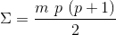
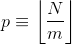

# 001
If we list all the natural numbers below 10 that are multiples of 3 or 5, we get 3, 5, 6 and 9. The sum of these multiples is 23.

Find the sum of all the multiples of 3 or 5 below 1000.

## Approach

This is a relatively straightforward problem, that can be solved either by constructing arrays composed of the multiples of 5 or 3 that are less than 1000 and computing the sum of the union of these arrays (which can be done easily with builtin functions in Python, Julia, or MATLAB), or by simply iterating from 1 to 999 and testing for multiple status using the modulo operator (as shown in the C++ solution).

There is an O(1) closed form method as well. The sum of all multiples of *m* that are less than a limit *N* (i.e. the sum of a [finite arithmetic series](http://mathworld.wolfram.com/ArithmeticSeries.html)) is:

where the quantity p is defined below:

The above equations can be used to solve this problem by setting *N* = 999 and then adding the sums computed with *m* = 3 and *m* = 5 minus the sum when *m* = 15 (to remove effect of double counting multiples of 15).
